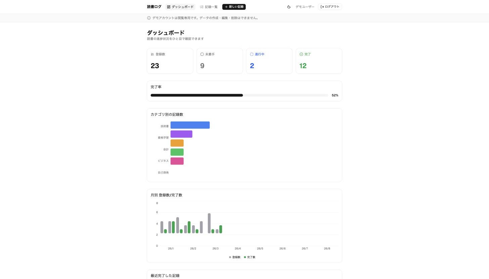
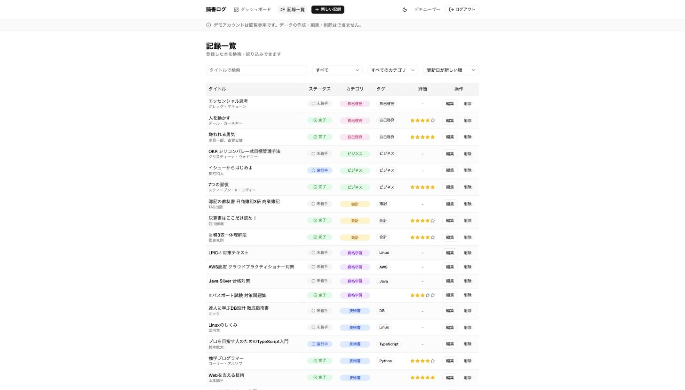
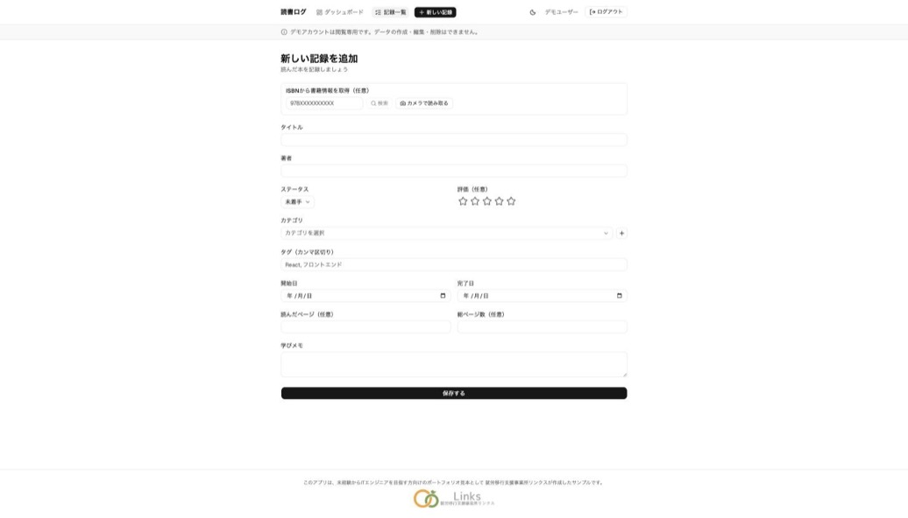
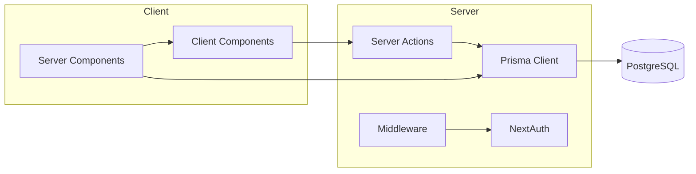
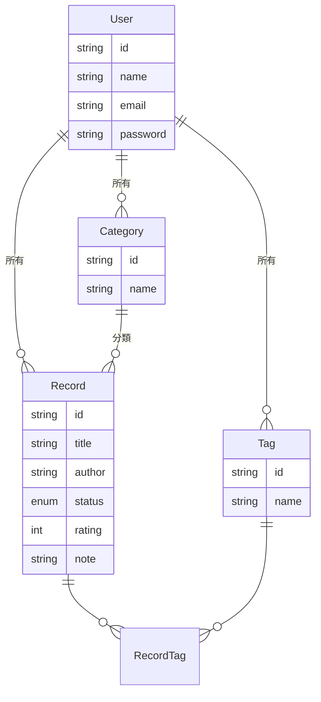
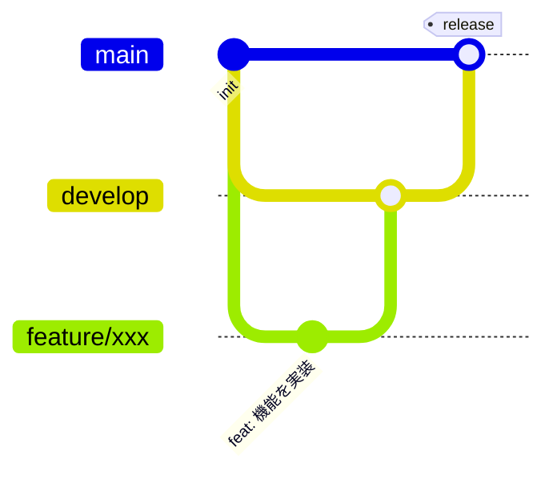

<div align="center">

# 📚 reading-log

読んだ本や学習した内容を記録し、進捗をひと目で振り返れる学習記録管理アプリ

[](https://github.com/links-mnakatani/reading-log/actions/workflows/ci.yml)
[](LICENSE)


[](https://reading-log-mnakatani.vercel.app)

[デモを見る](https://reading-log-mnakatani.vercel.app) ・ [機能](#主な機能) ・ [技術選定理由](#技術スタックと選定理由) ・ [セットアップ](#セットアップ手順)

</div>

> [!NOTE]
> このリポジトリは、未経験からITエンジニアを目指す方向けの就労移行支援を行う
> **[就労移行支援事業所リンクス](https://links-service.jp/)** が、ポートフォリオの作り方を
> 解説する教材として公開しているサンプルです。実際の開発フロー（Issue駆動・ブランチ運用・CI）を
> 一通り体験できる構成にしています。IT分野への就職・転職を検討されている方は、
> ぜひ [links-service.jp](https://links-service.jp/) もご覧ください。



## 目次

- [デモ](#デモ)
- [このアプリを作った背景](#このアプリを作った背景)
- [主な機能](#主な機能)
- [技術スタックと選定理由](#技術スタックと選定理由)
- [アーキテクチャ](#アーキテクチャ)
- [開発フロー](#開発フロー)
- [こだわった点](#こだわった点)
- [セットアップ手順](#セットアップ手順)
- [今後の展望](#今後の展望)
- [学んだこと・苦労した点](#学んだこと苦労した点)

## デモ

| | |
|---|---|
| **Demo URL** | https://reading-log-mnakatani.vercel.app |
| **テストアカウント** | `demo@reading-log.app` / `demo12345` |

すぐに操作感を確認したい場合は、上記のテストアカウントでログインしてください。ダークモードにも対応しています。

> **Note**: テストアカウントは不特定多数がアクセスするため閲覧専用です（作成・編集・削除はサーバー側でブロックされます）。CRUD操作を試したい場合は、[新規登録](https://reading-log-mnakatani.vercel.app/register)から自分のアカウントを作成してください。

## このアプリを作った背景

技術書や学習講座を進めていると、「今どのくらい読み終えているか」「何を学んだか」が記憶だけでは曖昧になりがちです。読んだ本や学習教材をカテゴリ・タグ・進捗ステータスで整理し、完了率や直近の学びを可視化できるアプリを作れば、学習の継続そのものをモチベーションに変えられるのではと考え、このアプリを作りました。

自分が新しい技術を学ぶときに実際に使うことを想定し、CRUD・認証・検索/フィルタ・簡易的なダッシュボードという、Webアプリの基本要素を一通り実装しています。

## 主な機能

### ダッシュボード

登録数・完了数・進行中・未着手の件数と完了率、直近で完了した記録を一覧できます。


### 記録一覧・検索・フィルタ

タイトル検索、ステータス・カテゴリによる絞り込みができます。



### 記録の登録・編集

タイトル・著者/教材名・ステータス・評価・カテゴリ・タグ（カンマ区切りで複数登録可）・開始日/完了日・学びメモを記録できます。カテゴリはフォーム上から追加可能です。



### 認証

メールアドレス・パスワードによる新規登録/ログインに対応しています。未ログイン時はログイン画面へ、ログイン済みで認証ページにアクセスした場合はダッシュボードへリダイレクトされます。

## 技術スタックと選定理由

| 技術 | 選定理由 |
|------|---------|
| [Next.js 15 (App Router)](https://nextjs.org/) | Server Components / Server Actions により、API を別途実装せずにフォーム送信からDB更新までを一貫した型安全なコードで書けるため |
| TypeScript (strict) | フォームの入力値からDBスキーマまで型を通し、実行時エラーを減らすため |
| [Prisma](https://www.prisma.io/) | スキーマ定義からマイグレーション・型付きクライアントまで一貫して扱え、リレーション（本とタグの多対多など）の設計・実装がしやすいため |
| PostgreSQL | Vercel 等の本番環境にそのままデプロイでき、実務でも採用実績の多いRDBのため |
| [NextAuth (Auth.js) v5](https://authjs.dev/) | App Router のServer Components/Server Actions/Middlewareとネイティブに統合でき、`lib/auth.ts` に認証設定を一元化できるため |
| [Zod](https://zod.dev/) | Server Actionsへの入力を実行時に検証し、フォームのバリデーションとDBスキーマの制約を1つの定義で表現できるため |
| Tailwind CSS + shadcn/ui | ユーティリティクラスで一貫したデザインを保ちつつ、Base UI ベースのアクセシブルなコンポーネントを土台にできるため |
| Vitest + Testing Library | Viteベースで高速に実行でき、Next.jsプロジェクトとの相性も良いため |

## アーキテクチャ



- `src/app/`: ルーティング（`(auth)` = 未認証向け、`(dashboard)` = 認証必須）
- `src/server/actions/`: フォーム送信を受け取るServer Actions（Zodで検証後、Prisma経由でDB更新）
- `src/server/queries/`: 画面表示用のDB読み取りクエリ
- `src/lib/`: 認証設定・Prisma Clientシングルトン・環境変数のZodスキーマ
- `src/components/ui/`: shadcn/ui のベースコンポーネント
- `src/components/features/`: 記録フォーム・一覧テーブル・フィルタなどの機能単位のコンポーネント

### ER図



## 開発フロー



`main` を安定版・本番デプロイ用ブランチとし、`develop` を開発の統合ブランチとして運用しています。

- 機能追加・修正は `feature/xxx` ブランチを `develop` から作成し、Pull Request経由で `develop` にマージ
- CI（Lint / 型チェック / テスト / ビルド）はPull Requestごとに自動実行
- `develop` の変更がまとまった時点で `develop` → `main` へマージし、Vercelが自動で本番デプロイ

## こだわった点

- Server Actions の戻り値を `{ error }` 形式に統一し、`useActionState` でエラーメッセージをフォーム上にそのまま表示できるようにした
- タグは自由入力（カンマ区切り）から自動でレコードを作成・関連付けする実装にし、ユーザーがタグ管理画面を意識せずに使えるようにした
- 認証設定を `auth.config.ts`（Middleware向け・DBアクセスなし）と `auth.ts`（Server Components向け・Credentials Provider含む）に分割し、Edge Runtime で動く Middleware に Prisma などNode.js依存のコードが混入しないようにした
- 全てのDBクエリに `userId` によるスコープを付与し、他ユーザーのデータにアクセスできないようにした

## セットアップ手順

### 前提

- Node.js 20.19+ / 22.12+ / 24.0+
- pnpm
- PostgreSQL（ローカルではDockerでの起動を想定）

### 手順

```bash
# 1. 依存パッケージのインストール
pnpm install

# 2. 環境変数の設定
cp .env.example .env
# DATABASE_URL, AUTH_SECRET を環境に合わせて編集

# 3. ローカルDBの起動（Dockerを利用する場合の例）
docker run -d --name reading-log-db \
  -e POSTGRES_USER=readinglog -e POSTGRES_PASSWORD=readinglog -e POSTGRES_DB=readinglog \
  -p 5432:5432 postgres:16-alpine

# 4. マイグレーションの実行
pnpm prisma migrate dev

# 5. デモデータの投入（任意）
pnpm db:seed

# 6. 開発サーバーの起動
pnpm dev
```

[http://localhost:3000](http://localhost:3000) にアクセスしてください。

### その他のコマンド

```bash
pnpm lint         # ESLint
pnpm type-check   # TypeScript 型チェック
pnpm test         # Vitest によるユニット/コンポーネントテスト
pnpm build        # プロダクションビルド
```

## 今後の展望

- 学習時間の記録・週次/月次でのグラフ表示
- タグ・カテゴリ別の集計ビュー
- 本の表紙画像の登録（外部書籍API連携）
- E2Eテスト（Playwright）の追加

## 学んだこと・苦労した点

- Server Actions を Middleware から呼び出せる構成にする過程で、Edge Runtime 非対応のライブラリ（Prisma・bcryptjs）が Middleware のバンドルに混入してしまう問題に直面し、Auth.js が推奨する「設定の分割」パターンで解決した
- 多対多のタグ機能は、中間テーブル（`RecordTag`）の設計とフォームからの自由入力の橋渡しをどう実装するかで最初つまずいたが、保存時に「タグ名からupsertして関連付け直す」方式にすることでシンプルに実装できた
- Zodのスキーマを Server Actions のファイルから独立させることで、`"use server"` ファイルの制約（関数以外をexportできない）を回避しつつ、バリデーションロジック単体でのユニットテストがしやすくなった

## ライセンス

[MIT](LICENSE)
