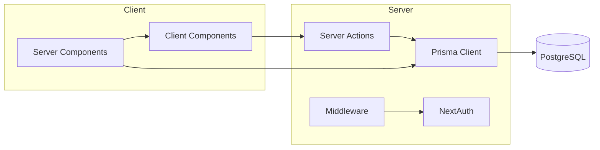
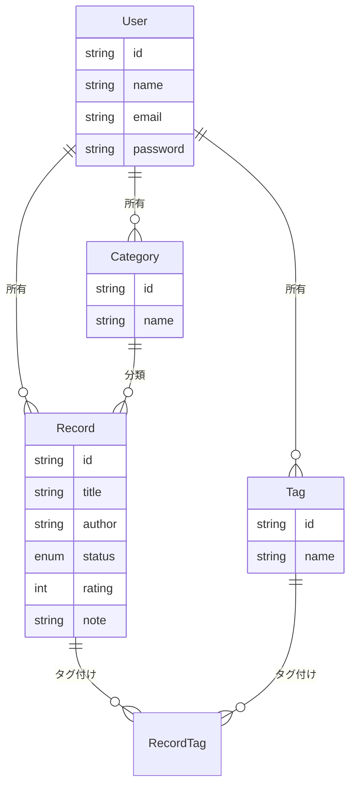
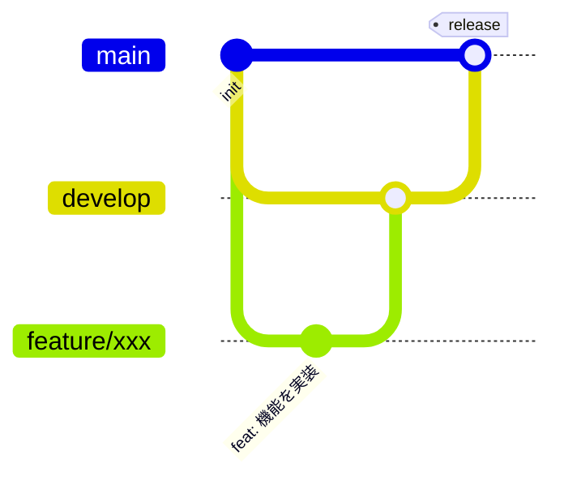

<div align="center">

# 📚 reading-log

読んだ本を記録し、進捗をひと目で振り返れる読書記録管理アプリ

[](https://github.com/links-online-support/reading-log/actions/workflows/ci.yml)
[](LICENSE)


[](https://reading-log-pi.vercel.app)

[デモを見る](https://reading-log-pi.vercel.app) ・ [機能](#主な機能) ・ [技術選定理由](#技術スタックと選定理由) ・ [セットアップ](#セットアップ手順)

</div>

<div align="center">
  <a href="https://links-service.jp/">
    
  </a>
</div>

> [!NOTE]
> このリポジトリは、未経験からITエンジニアを目指す方向けの就労移行支援を行う
> **[就労移行支援事業所リンクス](https://links-service.jp/)** が、ポートフォリオの作り方を
> 解説する教材として公開しているサンプルです。実際の開発フロー（Issue駆動・ブランチ運用・CI）を
> 一通り体験できる構成にしています。IT分野への就職・転職を検討されている方は、
> ぜひ [links-service.jp](https://links-service.jp/) もご覧ください。


## 目次

- [デモ](#デモ)
- [このアプリを作った背景](#このアプリを作った背景)
- [主な機能](#主な機能)
- [技術スタックと選定理由](#技術スタックと選定理由)
- [アーキテクチャ](#アーキテクチャ)
- [開発フロー](#開発フロー)
- [こだわった点](#こだわった点)
- [セットアップ手順](#セットアップ手順)
- [今後の展望](#今後の展望)
- [学んだこと・苦労した点](#学んだこと苦労した点)

## デモ

> [!TIP]
> **📝 ポートフォリオ解説:** 採用担当者はコードを読む前に、まず「動くもの」を見たいと思っています。デモURLとテストアカウントをREADMEの冒頭近くに置き、クローンやセットアップなしに一瞬で機能を確認できるようにすることで、実際に公開・運用しているという実績そのものをアピールできます。

- **Demo URL**: https://reading-log-pi.vercel.app
- **テストアカウント**: `demo@reading-log.app` / `demo12345`

すぐに操作感を確認したい場合は、上記のテストアカウントでログインしてください。ダークモードにも対応しています。

> **Note**: テストアカウントは不特定多数がアクセスするため閲覧専用です（作成・編集・削除はサーバー側でブロックされます）。CRUD操作を試したい場合は、[新規登録](https://reading-log-pi.vercel.app/register)から自分のアカウントを作成してください。
>
> このアプリはあくまで見本用のため、**新規登録したアカウントとそのデータは登録から3日後に自動的に削除されます**（テストアカウントは対象外）。継続利用が必要な場合は、[セットアップ手順](#セットアップ手順)に従ってご自身の環境で動かしてください。

## このアプリを作った背景

> [!TIP]
> **📝 ポートフォリオ解説:** 「なぜこれを作ったのか」は技術面接でほぼ必ず聞かれる質問です。動機が明確だと、後続の技術選定や機能の意思決定にも一貫したストーリーが生まれます。自分が実際に抱えていた課題を出発点にすることで、課題発見力・主体性を示せます。

技術書だけでなくビジネス書や自己啓発書などを並行して読んでいると、「今どのくらい読み終えているか」「何を学んだか」が記憶だけでは曖昧になりがちです。読んだ本をカテゴリ・タグ・進捗ステータスで整理し、完了率や直近の学びを可視化できるアプリを作れば、読書の継続そのものをモチベーションに変えられるのではと考え、このアプリを作りました。

自分が実際に読んだ本（技術書・資格学習・会計・ビジネス・自己啓発など）を記録することを想定し、CRUD・認証・検索/フィルタ・簡易的なダッシュボードという、Webアプリの基本要素を一通り実装しています。

## 主な機能

> [!TIP]
> **📝 ポートフォリオ解説:** 機能一覧は文章だけでなくスクリーンショット付きで見せることで、READMEを流し読みしただけでもアプリの全体像が伝わります。実装した機能の幅（CRUD・検索/フィルタ・可視化・外部API連携など）とUI/UXへの意識の両方を、実物で示せる項目です。

### ダッシュボード

登録数・完了数・進行中・未着手の件数と完了率に加え、カテゴリ別の記録数（横棒グラフ）、月別の登録数/完了数の推移（グループ棒グラフ）、直近で完了した記録（完了日・評価つき）を一覧できます。


### 記録一覧・検索・フィルタ

タイトル検索、ステータス・カテゴリによる絞り込み、並び替え（更新日・タイトル・完了日・評価順）ができます。


### 記録の登録・編集

タイトル・著者・ステータス・評価（星5段階）・カテゴリ・タグ（カンマ区切りで複数登録可）・開始日/完了日・読んだページ数/総ページ数・学びメモを記録できます。カテゴリはフォーム上から追加可能です。ISBNを入力（または対応ブラウザではカメラでバーコードを読み取り）すると、書誌情報APIからタイトル・著者を自動入力できます。


### 認証

メールアドレス・パスワードによる新規登録/ログインに対応しています。未ログイン時はログイン画面へ、ログイン済みで認証ページにアクセスした場合はダッシュボードへリダイレクトされます。

## 技術スタックと選定理由

> [!TIP]
> **📝 ポートフォリオ解説:** 使った技術を並べるだけでは「流行りのものを触ってみた」印象で終わってしまいます。「なぜその技術を選んだか」を一つずつ言語化することで、比較検討したうえで意思決定できることを示せます。表形式にまとめると採用担当者にとっても一覧性が高く読みやすくなります。

| 技術 | 選定理由 |
|------|---------|
| [Next.js 15 (App Router)](https://nextjs.org/) | Server Components / Server Actions により、API を別途実装せずにフォーム送信からDB更新までを一貫した型安全なコードで書けるため |
| TypeScript (strict) | フォームの入力値からDBスキーマまで型を通し、実行時エラーを減らすため |
| [Prisma](https://www.prisma.io/) | スキーマ定義からマイグレーション・型付きクライアントまで一貫して扱え、リレーション（本とタグの多対多など）の設計・実装がしやすいため |
| PostgreSQL | Vercel 等の本番環境にそのままデプロイでき、実務でも採用実績の多いRDBのため |
| [NextAuth (Auth.js) v5](https://authjs.dev/) | App Router のServer Components/Server Actions/Middlewareとネイティブに統合でき、`lib/auth.ts` に認証設定を一元化できるため |
| [Zod](https://zod.dev/) | Server Actionsへの入力を実行時に検証し、フォームのバリデーションとDBスキーマの制約を1つの定義で表現できるため |
| Tailwind CSS + shadcn/ui | ユーティリティクラスで一貫したデザインを保ちつつ、Base UI ベースのアクセシブルなコンポーネントを土台にできるため |
| Vitest + Testing Library | Viteベースで高速に実行でき、Next.jsプロジェクトとの相性も良いため |

## アーキテクチャ

> [!TIP]
> **📝 ポートフォリオ解説:** ディレクトリ構成や設計方針を図解しておくと、コードを1行も読まなくても設計意図が伝わります。特にER図はデータベース設計力の、構成図はレイヤー分割（関心の分離）への理解の証明になり、実務規模のコードを読み解く前提知識として採用担当者の負担も減らせます。



- `src/app/`: ルーティング（`(auth)` = 未認証向け、`(dashboard)` = 認証必須）
- `src/server/actions/`: フォーム送信を受け取るServer Actions（Zodで検証後、Prisma経由でDB更新）
- `src/server/queries/`: 画面表示用のDB読み取りクエリ
- `src/lib/`: 認証設定・Prisma Clientシングルトン・環境変数のZodスキーマ
- `src/components/ui/`: shadcn/ui のベースコンポーネント
- `src/components/features/`: 記録フォーム・一覧テーブル・フィルタなどの機能単位のコンポーネント

### ER図



## 開発フロー

> [!TIP]
> **📝 ポートフォリオ解説:** 個人開発であっても、Issue駆動・ブランチ運用・CIといった実務同様の開発プロセスを実践していることを示すと、チーム開発への適応力が伝わります。コミット履歴やPull Requestを実際に見てもらえれば、この節に書いた内容が「口だけ」ではないことも証明できます。



`main` を安定版・本番デプロイ用ブランチとし、`develop` を開発の統合ブランチとして運用しています。

- 機能追加・修正は `feature/xxx` ブランチを `develop` から作成し、Pull Request経由で `develop` にマージ
- CI（Lint / 型チェック / テスト / ビルド）はPull Requestごとに自動実行
- `develop` の変更がまとまった時点で `develop` → `main` へマージし、Vercelが自動で本番デプロイ

## こだわった点

> [!TIP]
> **📝 ポートフォリオ解説:** コードを読むだけでは伝わりにくい「なぜその実装にしたか」という思考プロセスを言語化する項目です。単に動くものを作るだけでなく、保守性・セキュリティ・ユーザー体験まで考慮していることを、具体的な設計判断とセットで示せます。

- Server Actions の戻り値を `{ error }` 形式に統一し、`useActionState` でエラーメッセージをフォーム上にそのまま表示できるようにした
- タグは自由入力（カンマ区切り）から自動でレコードを作成・関連付けする実装にし、ユーザーがタグ管理画面を意識せずに使えるようにした
- 認証設定を `auth.config.ts`（Middleware向け・DBアクセスなし）と `auth.ts`（Server Components向け・Credentials Provider含む）に分割し、Edge Runtime で動く Middleware に Prisma などNode.js依存のコードが混入しないようにした
- 全てのDBクエリに `userId` によるスコープを付与し、他ユーザーのデータにアクセスできないようにした
- ダッシュボードの「カテゴリ別の記録数」は円グラフではなく横棒グラフを採用した。カテゴリはユーザーが自由に追加できるため件数が可変であり、項目数が増えても崩れず、件数の大小を正確に比較できる横棒グラフの方が長期的に安全と判断した（円グラフは扇形の面積比較が要素数の増加とともに難しくなる）
- 「月別の推移」グラフは当初、進捗ステータス（未着手/進行中/完了）の内訳を円グラフで表示していたが、その数値は上部の統計カードと完了率バーで既に示されており、円グラフは同じ情報の再掲に留まっていた。そこで「月ごとの登録ペースと完了ペースの比較」という、画面上のどこにもなかった情報を提供するグループ棒グラフ（登録数/完了数）に置き換えた
- 誰でも登録できる公開デモという性質上、大量の自動登録によってNeon/Vercelの無料枠を消費してしまうリスクがある。ハニーポット（人間には見えない入力欄にbotが値を入れたら拒否）とIPごとの登録試行回数制限を実装し、Vercel Cronで登録から3日経過したアカウント（テストアカウントを除く）を自動削除するようにして、見本用デモとして安全に運用できるようにした
- 上記に加え、ログイン試行にもIPベースのレート制限を設けブルートフォース攻撃を抑止、ISBN検索機能はデモアカウントでの利用を禁止しユーザーごとのレート制限も設定、記録の登録件数にも上限（500件）を設け、公開デモが自動化ツールによる悪用の踏み台にならないようにした

## セットアップ手順

> [!TIP]
> **📝 ポートフォリオ解説:** 採用担当者やエンジニアが実際に手元でアプリを動かして確認できるようにする項目です。前提条件からコマンドまで再現性のある手順を過不足なく書けることは、ドキュメンテーション能力・チームメンバーへの配慮の証明にもなります。

### 前提

- Node.js 20.19+ / 22.12+ / 24.0+
- pnpm
- PostgreSQL（ローカルではDockerでの起動を想定）

### 手順

```bash
# 1. 依存パッケージのインストール
pnpm install

# 2. 環境変数の設定
cp .env.example .env
# DATABASE_URL, AUTH_SECRET を環境に合わせて編集

# 3. ローカルDBの起動（Dockerを利用する場合の例）
docker run -d --name reading-log-db \
  -e POSTGRES_USER=readinglog -e POSTGRES_PASSWORD=readinglog -e POSTGRES_DB=readinglog \
  -p 5432:5432 postgres:16-alpine

# 4. マイグレーションの実行
pnpm prisma migrate dev

# 5. デモデータの投入（任意）
pnpm db:seed

# 6. 開発サーバーの起動
pnpm dev
```

[http://localhost:3000](http://localhost:3000) にアクセスしてください。

### その他のコマンド

```bash
pnpm lint         # ESLint
pnpm type-check   # TypeScript 型チェック
pnpm test         # Vitest によるユニット/コンポーネントテスト
pnpm build        # プロダクションビルド
```

## 今後の展望

> [!TIP]
> **📝 ポートフォリオ解説:** 「完成として終わらせず、次に何を作りたいか」を書くことで学習意欲の継続性をアピールできます。また、検討したが実装を見送った機能について理由まで書いておくと（このアプリではGoogle Books APIのクォータ・悪用リスクを理由に見送った例があります）、実装しない判断も含めた技術的な意思決定力を示せます。

- 読書に費やした時間（分）の記録と、その推移グラフ表示（現在ダッシュボードにあるのは冊数ベースの推移のみ）
- タグ別の集計ビュー（カテゴリ別は実装済み）
- 本の表紙画像の登録（外部書籍API連携）
- E2Eテスト（Playwright）の追加
- Google Books API 経由でのISBNからの総ページ数自動取得（現在使用しているopenBDにはページ数情報が含まれていないことを確認済み。Google Books APIなら取得可能だが、公開デモでAPIキーを組み込むとクォータ枯渇や悪用のリスクがあるため、今回は見送った）
- 年間読書目標の設定と達成率の可視化（例:「今年◯冊」を目標に設定し、ダッシュボードで進捗を確認できるようにする）
- 読書記録のCSVエクスポート（バックアップや他の読書管理サービスへの移行に活用できるように）

## 学んだこと・苦労した点

> [!TIP]
> **📝 ポートフォリオ解説:** つまずいた問題とその解決策を具体的に書くことで、問題解決能力を証明できる項目です。「動くようになった」で終わらせず「なぜ動くようになったか」まで理解していることが伝われば、初対面の技術面接官にもデバッグ力・粘り強さが伝わります。

- Server Actions を Middleware から呼び出せる構成にする過程で、Edge Runtime 非対応のライブラリ（Prisma・bcryptjs）が Middleware のバンドルに混入してしまう問題に直面し、Auth.js が推奨する「設定の分割」パターンで解決した
- 多対多のタグ機能は、中間テーブル（`RecordTag`）の設計とフォームからの自由入力の橋渡しをどう実装するかで最初つまずいたが、保存時に「タグ名からupsertして関連付け直す」方式にすることでシンプルに実装できた
- Zodのスキーマを Server Actions のファイルから独立させることで、`"use server"` ファイルの制約（関数以外をexportできない）を回避しつつ、バリデーションロジック単体でのユニットテストがしやすくなった

## ライセンス

[MIT](LICENSE)
